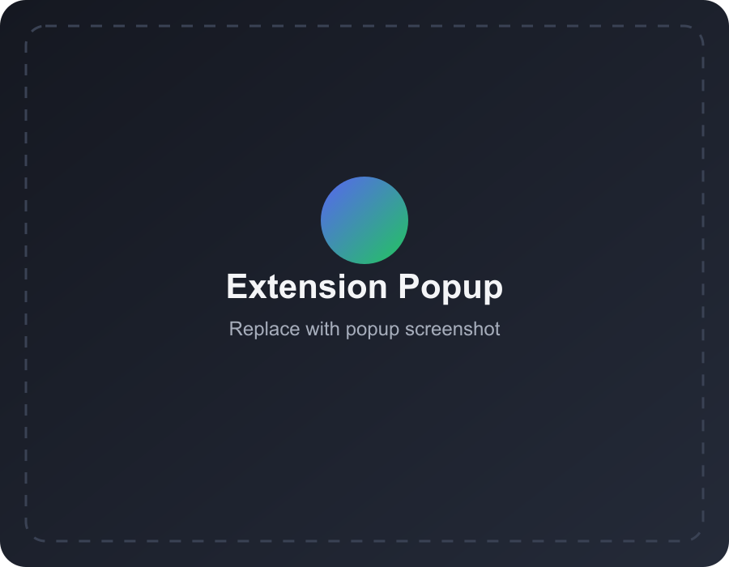
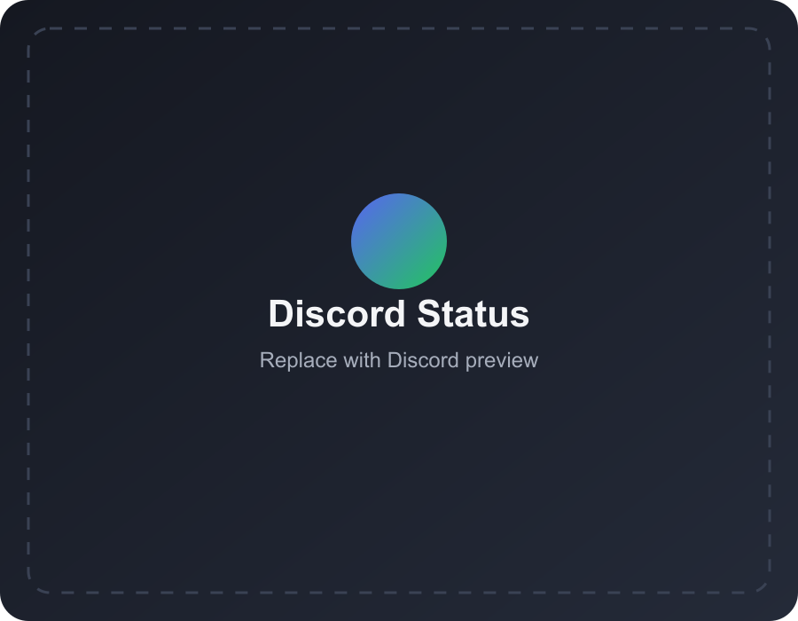
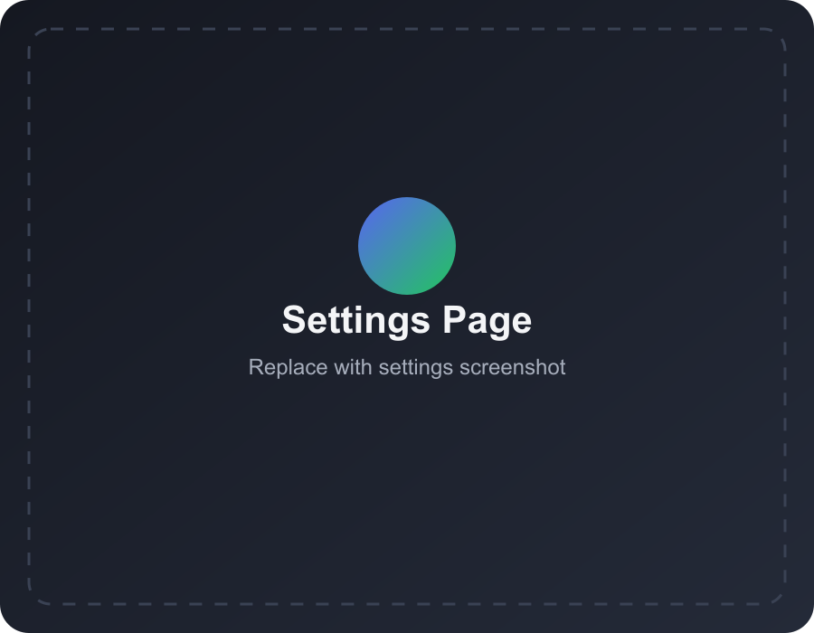
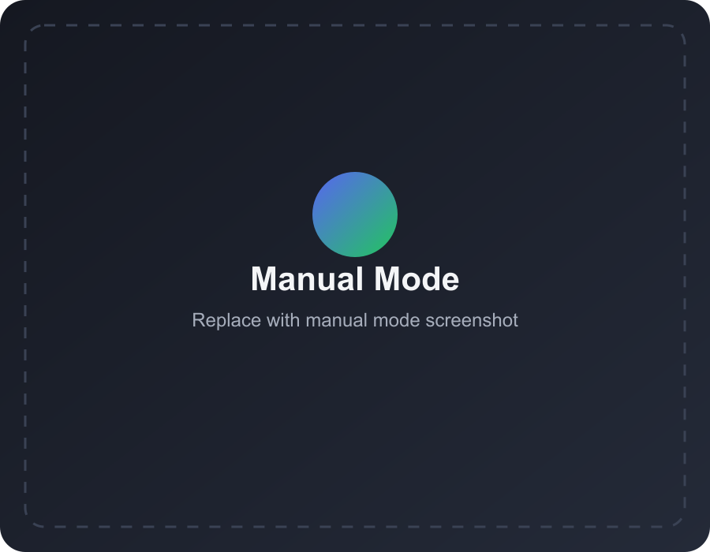
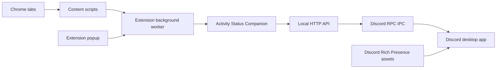

# Discord Status

<p align="center">
  <strong>Show what you are watching, listening to, reading, or working on as a Discord activity status from your browser.</strong>
</p>

<p align="center">
  <a href="https://github.com/GSUS2K/discord-status/releases/latest"></a>
  <a href="LICENSE"></a>
  <a href="https://github.com/GSUS2K/discord-status/stargazers"></a>
  
  
</p>

<p align="center">
  
</p>

<p align="center">
  <a href="#overview">Overview</a>
  |
  <a href="#features">Features</a>
  |
  <a href="#screenshots">Screenshots</a>
  |
  <a href="#install">Install</a>
  |
  <a href="#discord-assets">Discord Assets</a>
  |
  <a href="#run-from-source">Run From Source</a>
  |
  <a href="#roadmap">Roadmap</a>
</p>

## Overview

Discord Status is a Chrome extension with a local companion app that turns supported browser activity into Discord Rich Presence.

It can detect media and page activity from sites like YouTube, Netflix, Spotify, Twitch, GitHub, ChatGPT, Google Meet, Crunchyroll, Hotstar, Google, and Wikipedia. The extension handles detection inside the browser, while the backend talks to the Discord desktop app through Discord RPC.

## Install Model

The release flow is:

1. Install the Discord Status browser extension.
2. Install the Activity Status Companion desktop app.
3. Open Discord desktop.
4. Browse normally.

The companion app runs the local Discord RPC bridge in the background.

## Why There Is A Companion App

Discord Rich Presence is local. A Chrome extension cannot directly access Discord's local RPC socket, so Activity Status is split into two parts:

| Part | What it does |
| --- | --- |
| `extension/` | Detects browser activity, lets you choose auto or manual mode, and sends updates to the backend |
| `src-tauri/` + `tauri-ui/` | Lightweight native companion that starts and supervises the local Discord RPC bridge |
| `backend/` | Legacy Node backend kept for source/manual development |

Because of that, the best user experience is not “extension only.” The best experience is **Chrome extension + native companion app**.

## Development Status

Discord Status is still in early development phase.

YouTube, Netflix, Spotify, GitHub, ChatGPT, Google Meet, Twitch, and a few other sites are supported, but some websites change their page structure often. Detection can occasionally need updates when a site changes its DOM.

## Features

| Area | What it does |
| --- | --- |
| Auto detect | Picks up activity from supported browser tabs |
| Current-tab priority | Auto mode prefers the tab you are actually viewing instead of randomly swapping between background tabs |
| Manual mode | Lets you set a custom title and message for Discord |
| Media timestamps | Shows play progress for supported video/audio pages |
| Discord assets | Includes 512x512 logo assets ready for Discord Developer Portal upload |
| Status controls | Enable, clear, refresh, reconnect, and select a specific tab from the popup |
| Diagnostics | Backend health, Discord RPC health, and recent extension logs |
| Tray companion | Runs the local backend from the macOS menu bar, Windows tray, or Linux system tray |
| Release packaging | Builds extension and companion artifacts for GitHub Releases |

## Supported Sites

| Site | Status |
| --- | --- |
| YouTube | Supported |
| Netflix | Supported, title detection may vary by region/player UI |
| Spotify | Supported |
| Twitch | Supported |
| GitHub | Supported |
| ChatGPT | Supported |
| Google Meet | Supported |
| Crunchyroll | Supported |
| Hotstar | Supported |
| Wikipedia | Supported |
| Google Search | Supported |
| Manual custom status | Supported |

## Screenshots

<p align="center">
  
  
</p>

<p align="center">
  
  
</p>

## Install

Get the latest release from the [GitHub Releases page](https://github.com/GSUS2K/discord-status/releases/latest).

Download:

- Chrome Web Store listing is coming soon. Until then, install manually from the release zip.
- the Activity Status Companion app for your platform

Then:

1. Install/open **Activity Status Companion**.
2. Make sure Discord desktop is open.
3. Install **Discord Status** from the Chrome Web Store.
4. Keep the companion app running while using Discord status.

Until the Chrome Web Store listing is live, download the manual extension zip from GitHub Releases, extract it, open chrome://extensions, enable Developer mode, click Load unpacked, and select the extracted extension folder.

Installation note: current companion builds are unsigned.
Windows SmartScreen/macOS Gatekeeper may warn because the app is not code-signed yet.

Allow the companion to run from your OS settings.
For macOS:
```bash
sudo xattr -cr "/Applications/Activity Status Companion.app"
```

or go to Privacy & Security settings and press on Allow in the Security section at bottom beside the warning.

```bash
npm install
```


Companion note: the companion runs as a background tray/menu-bar app. Click the tray icon to open the compact control popover. Use **Settings** from that popover for launch-at-login, backend startup, and diagnostics.

## Build Releases

Install dependencies:

```bash
npm install
```

Package the extension:

```bash
npm run package
```

Package the Chrome Web Store upload zip:

```bash
npm run package:webstore
```

Build the companion app for your current platform:

```bash
npm run dist:companion
```

The public companion is built with Tauri, so the downloads stay much smaller than the old Electron build.

Legacy Electron build commands are still available for comparison/debugging:

```bash
npm run dist:companion:electron
npm run dist:companion:mac
npm run dist:companion:win
npm run dist:companion:linux
```

Tauri build output goes to `src-tauri/target/release/bundle/`.

## Publishing A GitHub Release

Pushes to `main` and pull requests build temporary GitHub Actions artifacts. They do not create a public Release page.

To publish a real GitHub Release with the `.dmg`, `.exe`, `.AppImage`, extension zips, and `SHA256SUMS.txt`, create and push a version tag:

```bash
git tag v1.0.0
git push origin v1.0.0
```

The release workflow uses GitHub's built-in `GITHUB_TOKEN`, so no personal access token is needed.

## How To Use

1. Start Discord desktop.
2. Start Activity Status Companion; it will live in the menu bar/system tray.
3. Open Chrome and visit a supported site.
4. Open the extension popup.
5. Use **Auto Detect** to follow the current tab, or choose a specific detected tab.
6. Use **Manual** if you want to set your own title and message.
7. Use **Clear** when you want to remove the activity.

## Settings Behavior

| Setting | Works? | Notes |
| --- | --- | --- |
| Backend Server URL | Yes | Keep it as `http://localhost:17654` unless you run the local backend somewhere else on the same machine |
| Update Interval | Yes | Controls how often supported tabs are asked to refresh activity |
| Forget Inactive Tabs After | Yes | Removes stale tab activity from the popup and auto picker |
| Enabled Sites | Filter only | The checklist enables/disables already-supported detectors; new sites require code support |
| Log Level | Yes | Controls extension-side diagnostic logging |
| Discord Application ID | Companion build only | Maintainers set this in `src-tauri/src/main.rs` before building public releases |

## Run From Source

Install backend dependencies:

```bash
npm run install:backend
```

Run checks:

```bash
npm run check
```

Start the backend:

```bash
npm start
```

Run the companion app in development:

```bash
npm run companion:dev
```

Run the legacy Electron companion:

```bash
npm run companion:dev:electron
```

Run backend in watch mode:

```bash
npm run dev
```

Package the extension and backend:

```bash
npm run package
```

Package only the Chrome Web Store upload:

```bash
npm run package:webstore
```

Check backend status:

```bash
curl http://localhost:17654/api/status
```

## Architecture



## Project Structure

```text
extension/             Chrome extension files
extension/scripts/     Site detectors and background worker
src-tauri/             Lightweight native companion and local HTTP/RPC bridge
tauri-ui/              Companion tray popover and settings UI
companion/             Legacy Electron companion shell
backend/               Legacy Node Discord RPC bridge
discord-assets-real/   Rich Presence logo assets
scripts/               Release/package helpers
.github/workflows/     GitHub Actions release packaging
```

## Troubleshooting

| Problem | Try this |
| --- | --- |
| Discord says disconnected | Make sure Discord desktop is open, then restart the companion app |
| Companion has no Dock/window presence | This is intentional; click the menu bar/system tray icon for controls and Settings |
| Extension says backend offline | Confirm Activity Status Companion is running and settings use `http://localhost:17654` |
| Auto mode swaps tabs | Reload the extension; auto mode should prioritize the active Chrome tab |
| Netflix title is wrong | Reload the Netflix tab and click Refresh in the popup |

## Release Notes

GitHub Actions builds temporary artifacts on pushes, pull requests, and manual runs. It publishes a GitHub Release only when a `v*` tag is pushed.

The GitHub release assets include:

- Activity Status Companion for macOS (`.dmg`)
- Activity Status Companion for Windows (`.exe` and `.msi`)
- Activity Status Companion for Linux (`.AppImage` and `.deb`)
- Discord Status extension/manual install bundle
- Chrome Web Store upload zip
- SHA-256 checksums

The Chrome Web Store upload is generated separately at:

```text
dist/discord-status-webstore.zip
```

That zip has `manifest.json` at the root, which is the format the Chrome Web Store expects.

## Star History

<a href="https://www.star-history.com/#GSUS2K/discord-status&Date">
  
</a>

## Contributing

Bug reports, site detector fixes, UI improvements, and setup simplifications are welcome.

When adding a new site detector, include:

- The content script or generic detector logic
- A matching Discord asset key (in case you are creating own discord application in developer portal - update the client ID in the code)
- A short note in the supported-sites table
- A test run with `npm run check`

## License

This project is licensed under the MIT License. See the [LICENSE](LICENSE) file for details.
