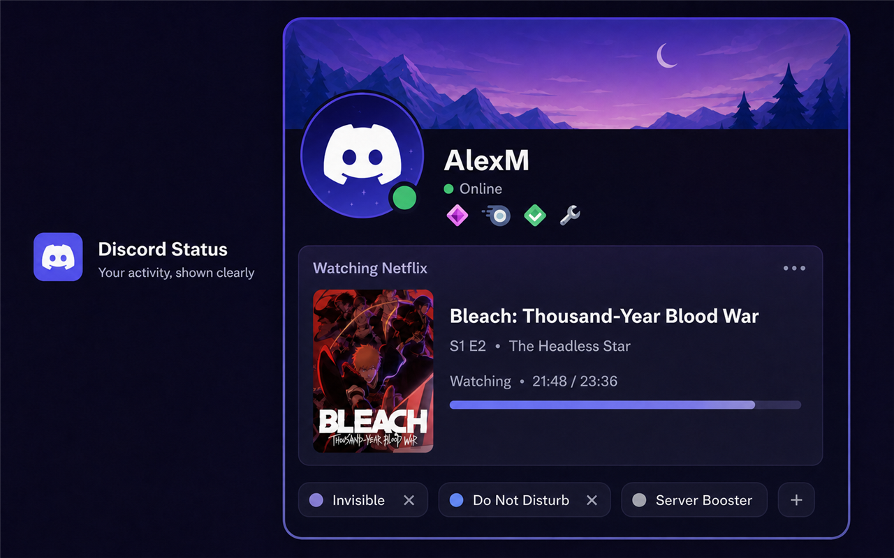

# Discord Status

Show what you are doing in Discord Rich Presence. Discord Status detects browser media, desktop apps, games, and custom activities through a Chrome extension and a small local companion app.

<p align="center">
  <a href="https://gsus2k.github.io/discord-status/"></a>
  <a href="https://chromewebstore.google.com/detail/discord-status/ekobpekegflobmheipgceigkldggkakd?hl=en"></a>
  <a href="https://github.com/GSUS2K/discord-status/releases/latest"></a>
  <a href="https://github.com/GSUS2K/discord-status/releases"></a>
  <a href="LICENSE"></a>
</p>

<p align="center"><strong>Windows · macOS · Linux</strong> &nbsp;|&nbsp; Chrome extension + local companion &nbsp;|&nbsp; open source</p>

<p align="center"></p>

## Install

Most people need both parts:

1. Install [Discord Status from the Chrome Web Store](https://chromewebstore.google.com/detail/discord-status/ekobpekegflobmheipgceigkldggkakd?hl=en).
2. Download the companion for your operating system from the [latest GitHub release](https://github.com/GSUS2K/discord-status/releases/latest), or use the [download site](https://gsus2k.github.io/discord-status/).
3. Open Discord desktop and start the companion. It stays in the system tray or menu bar.
4. Pin the extension to Chrome and choose Auto Detect, Active Tab Only, or a custom activity.

The extension is needed for browser tabs. The companion is needed to connect to Discord desktop and can also work by itself for custom statuses, supported desktop apps, and games.

### Which companion file should I download?

| System | Recommended file |
| --- | --- |
| Windows | `Discord-Status-Companion-Windows-Setup.exe` |
| Windows managed install | `Discord-Status-Companion-Windows.msi` |
| macOS with Apple Silicon | `Discord-Status-Companion-macOS-Apple-Silicon.dmg` |
| macOS with Intel | `Discord-Status-Companion-macOS-Intel.dmg` |
| Linux | `Discord-Status-Companion-Linux.AppImage` |
| Debian or Ubuntu | `Discord-Status-Companion-Linux.deb` |

The release also includes checksums. Verify the downloaded file with `SHA256SUMS.txt` when you need to confirm its integrity.

## What It Can Show

- Watching activity from YouTube, Netflix, Prime Video, Hulu, Disney+, Apple TV, Hotstar, Crunchyroll, Twitch, and other supported media sites.
- Listening activity from Spotify, YouTube Music, SoundCloud, Apple Music, and Bandcamp.
- Browser work from GitHub, VS Code Web, Linear, Jira, Notion, Google Docs, Figma, Canva, ChatGPT, and Google Meet.
- Learning, social, and game activity from Coursera, Udemy, Khan Academy, LeetCode, Reddit, X, Instagram, LinkedIn, Steam, Chess.com, Lichess, Skribbl.io, GeoGuessr, and Wikipedia.
- Local activity from VLC and other supported desktop applications and games.
- Manual custom activities with your own title, details, state, artwork, buttons, and timestamps.

Media artwork is shown when a supported site exposes usable poster or album art. If an image cannot be used by Discord, the companion falls back to the platform artwork instead of inventing a thumbnail.

## Useful Controls

- Auto Detect follows the best available activity.
- Active Tab Only prevents background tabs from taking over your status.
- The activity selector lets you choose one detected tab quickly.
- Manual mode pins a selected activity until you change it.
- Custom Status lets you write your own activity and choose timestamps and artwork.
- Shortcuts can be changed in Companion Settings. The default selector shortcut is `CommandOrControl+Shift+Y`.
- Site toggles, blocked domains, private mode, platform-only mode, incognito blocking, and meeting pause controls limit what is shared.
- The companion diagnostics panel helps check Discord, extension, backend, and version connections.

## Screenshots

<p align="center">
  
  
</p>
<p align="center">
  
  
</p>
<p align="center"></p>

## How It Works

```text
Chrome tab -> extension -> localhost companion -> Discord desktop
```

The default local connection is `http://localhost:17654`. Activity data is sent to the local companion, not to a Discord Status server. Discord desktop must be open because it owns the Rich Presence connection.

The companion can also publish a manual or desktop-app activity without the extension:

```text
Desktop app or custom status -> companion -> Discord desktop
```

## Privacy

Discord Status is designed to run locally. The extension reads supported pages only to build the activity you choose to share. The companion receives that activity over localhost and sends it to Discord desktop. Use the privacy controls to hide titles, restrict sites, block incognito tabs, or stop automatic updates.

See the full [privacy policy](PRIVACY.md).

## Troubleshooting

### Discord is disconnected

Open Discord desktop first, restart the companion, and use Reconnect Discord in the companion. If the extension says the backend is offline, confirm that the companion is running and that its URL is `http://localhost:17654`.

### The wrong tab or app is showing

Refresh the page, then select Active Tab Only or choose the activity from the selector. Manual mode can keep an older selection active until you switch back to Auto Detect.

### The title or thumbnail is wrong

Refresh the media page and check that the correct site detector is enabled. Some sites expose only a page title or platform icon, and Discord may reject an image URL that is not publicly reachable.

### The companion does not detect VLC or another desktop app

Keep the companion running, allow the application in the system-app settings, and bring the desired app to the foreground. App detection is local and only covers supported applications.

### The extension and companion versions do not match

Update both parts. The Chrome Web Store updates the extension separately from the companion installers in GitHub Releases.

## Development

Requirements: Node.js, npm, Rust, and the platform toolchain required by Tauri.

```bash
npm install
npm run check
npm run package:webstore
```

The Chrome Web Store package is written to `dist/discord-status-webstore.zip`.

To run the companion during development:

```bash
npm run companion:dev
```

## Releases

GitHub Actions builds the companion installers and publishes the release assets. Use the [latest release](https://github.com/GSUS2K/discord-status/releases/latest) for downloads and checksums. The [download site](https://gsus2k.github.io/discord-status/) explains which file belongs to each operating system.

## Support

- [Report a bug or request a feature](https://github.com/GSUS2K/discord-status/issues)
- [Browse releases](https://github.com/GSUS2K/discord-status/releases)
- [Open the download site](https://gsus2k.github.io/discord-status/)

## License

Discord Status is released under the [MIT License](LICENSE).
