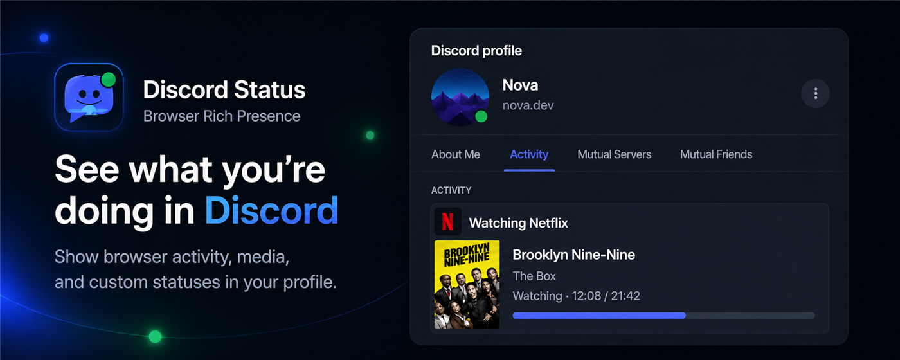
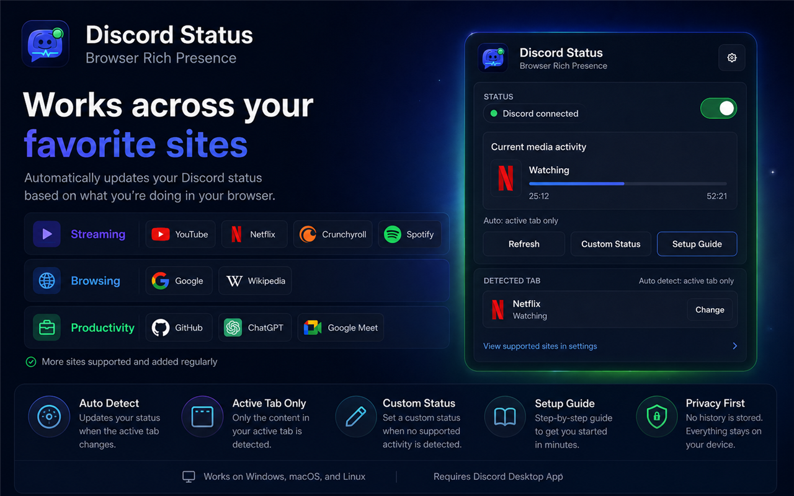
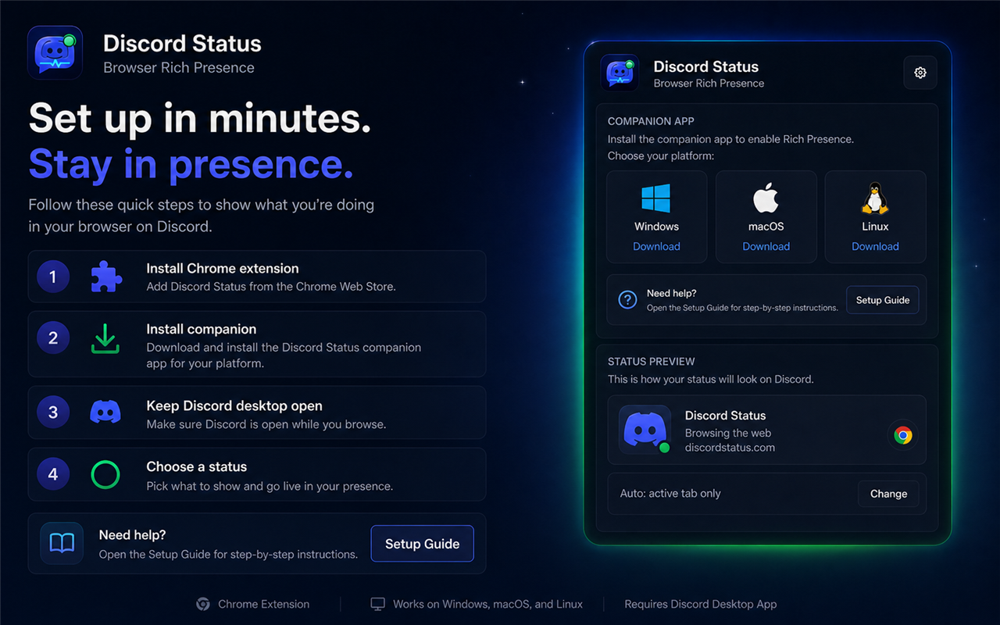
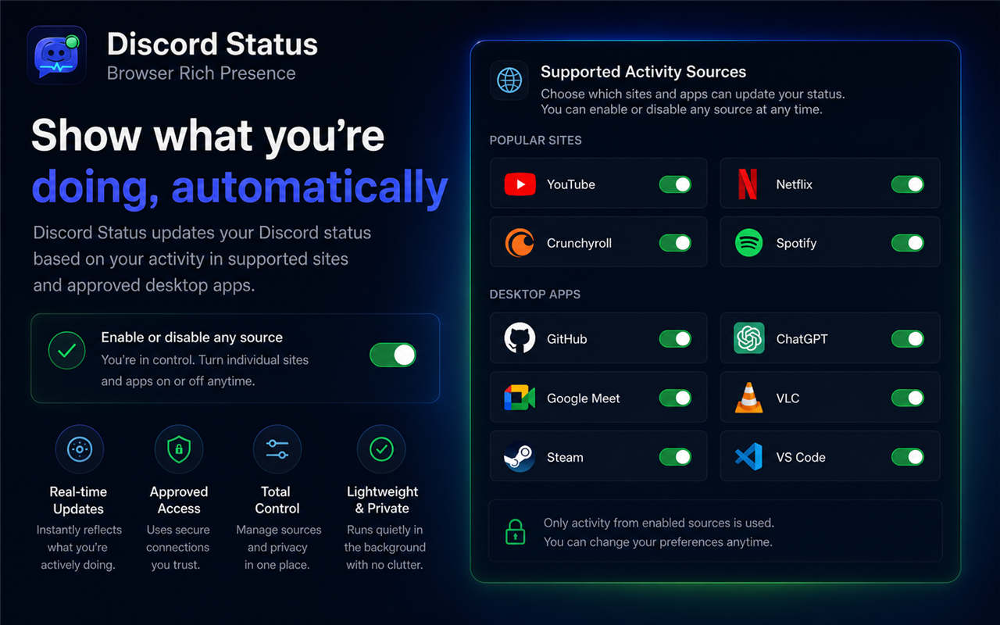
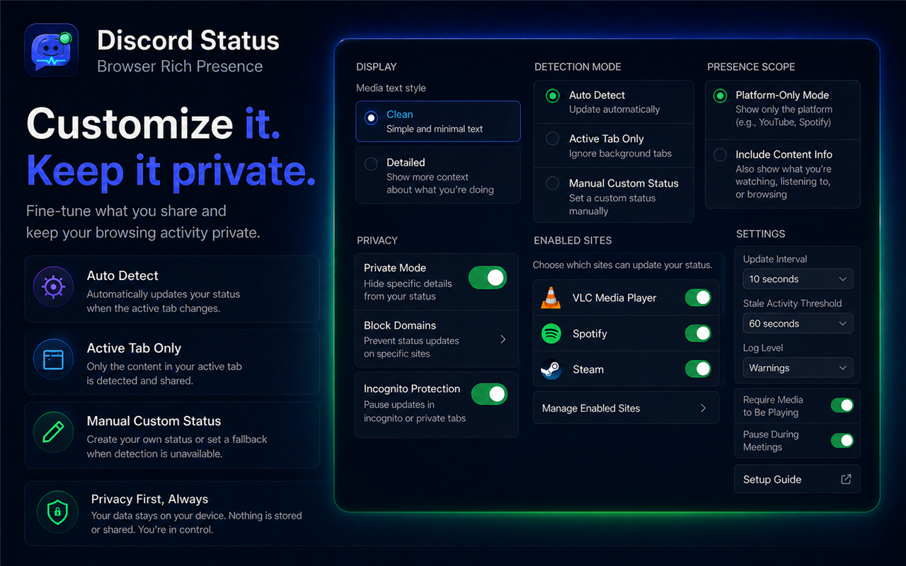

# Discord Status

Show what you are watching, listening to, playing, or working on in Discord Rich Presence.

<p align="center">
  <a href="https://gsus2k.github.io/discord-status/"></a>
  <a href="https://chromewebstore.google.com/detail/discord-status/ekobpekegflobmheipgceigkldggkakd?hl=en"></a>
  <a href="https://github.com/GSUS2K/discord-status/releases/latest"></a>
  <a href="https://github.com/GSUS2K/discord-status/releases"></a>
</p>

<p align="center"><strong>Windows · macOS · Linux</strong> &nbsp;|&nbsp; Chrome extension + local companion &nbsp;|&nbsp; open source</p>

<p align="center"></p>

## Install

You need both parts for browser activity:

1. Install the [Chrome extension](https://chromewebstore.google.com/detail/discord-status/ekobpekegflobmheipgceigkldggkakd?hl=en).
2. Download the companion from the [latest release](https://github.com/GSUS2K/discord-status/releases/latest) or the [download site](https://gsus2k.github.io/discord-status/).
3. Open Discord desktop and start the companion. It stays in the system tray or menu bar.
4. Pin the extension and choose Auto Detect.

The companion also works without the extension for custom activities, supported desktop apps, and games.

### Companion downloads

| Platform | File |
| --- | --- |
| Windows | `Discord-Status-Companion-Windows-Setup.exe` |
| Windows managed install | `Discord-Status-Companion-Windows.msi` |
| macOS Apple Silicon | `Discord-Status-Companion-macOS-Apple-Silicon.dmg` |
| macOS Intel | `Discord-Status-Companion-macOS-Intel.dmg` |
| Linux | `Discord-Status-Companion-Linux.AppImage` |
| Debian or Ubuntu | `Discord-Status-Companion-Linux.deb` |

`SHA256SUMS.txt` is included in each release for checksum verification.

## Features

- Browser media activity with show posters, album art, playback state, and timing when available.
- Watching activity for YouTube, Netflix, Prime Video, Hulu, Disney+, Apple TV, Hotstar, Crunchyroll, and Twitch.
- Listening activity for Spotify, YouTube Music, SoundCloud, Apple Music, and Bandcamp.
- Activity for GitHub, VS Code Web, Linear, Jira, Notion, Google Docs, Figma, Canva, ChatGPT, Google Meet, and more.
- Local activity detection for VLC, supported desktop apps, and games.
- Custom activities with your own title, details, artwork, buttons, and timestamps.
- Auto Detect, Active Tab Only, manual selection, configurable shortcuts, and system-tray controls.
- Privacy controls for enabled sites, blocked domains, private mode, incognito tabs, hidden titles, and meeting pauses.

## Screenshots

<p align="center">
  
  
</p>
<p align="center">
  
  
</p>
<p align="center"></p>

## How It Works

```text
Chrome tab -> extension -> localhost companion -> Discord desktop
```

The companion connects to Discord desktop through the local endpoint `http://localhost:17654`. Activity data is sent locally; there is no Discord Status server in the middle. Discord desktop must be open for Rich Presence.

The companion-only path is:

```text
Desktop app or custom activity -> companion -> Discord desktop
```

## Privacy

The extension reads supported pages only to build the activity you choose to share. The companion receives that activity over localhost and sends it to Discord desktop. Use the privacy controls to decide which sites, titles, and activity details are allowed.

Read the [privacy policy](PRIVACY.md).

## Troubleshooting

**Discord is disconnected:** Open Discord desktop, restart the companion, and use Reconnect Discord. Confirm the companion URL is `http://localhost:17654`.

**The wrong tab is showing:** Refresh the page, use Active Tab Only, or select the activity from the selector. Manual mode stays selected until you return to Auto Detect.

**The title or thumbnail is wrong:** Refresh the media page and check that the site detector is enabled. Some sites expose only a title or platform icon, and Discord may reject images that are not publicly reachable.

**VLC or another app is missing:** Keep the companion running, allow the application in system-app settings, and bring it to the foreground.

**Versions do not match:** Update the extension and companion separately. The Web Store updates the extension; GitHub Releases provides the companion installers.

## Development

Requirements: Node.js, npm, Rust, and the platform toolchain required by Tauri.

```bash
npm install
npm run check
npm run package:webstore
npm run companion:dev
```

The Chrome Web Store package is written to `dist/discord-status-webstore.zip`.

## Links

- [Download site](https://gsus2k.github.io/discord-status/)
- [Latest release](https://github.com/GSUS2K/discord-status/releases/latest)
- [Chrome Web Store](https://chromewebstore.google.com/detail/discord-status/ekobpekegflobmheipgceigkldggkakd)
- [Issues and feature requests](https://github.com/GSUS2K/discord-status/issues)
- [MIT License](LICENSE)
