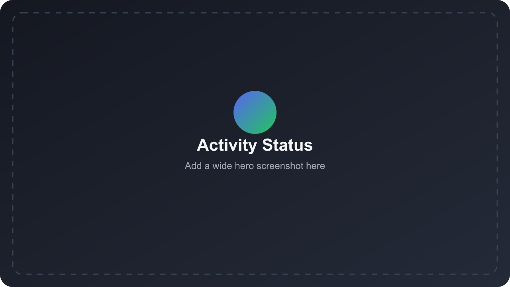

# Discord Status

Show supported Chrome activity as Discord Rich Presence through a small local companion app.

<p align="center">
  <a href="https://chromewebstore.google.com/detail/ekobpekegflobmheipgceigkldggkakd"></a>
  <a href="https://github.com/GSUS2K/discord-status/releases/latest"></a>
  <a href="LICENSE"></a>
</p>



## Install In 3 Steps

1. Install the [Chrome extension](https://chromewebstore.google.com/detail/ekobpekegflobmheipgceigkldggkakd).
2. Install the [companion app](https://github.com/GSUS2K/discord-status/releases/latest).
3. Open Discord desktop and keep the companion running in the menu bar/system tray.

The extension detects activity. The companion runs on `localhost`, chooses the active status, and sends it to Discord desktop.

## Features

| Feature | What it does |
| --- | --- |
| Activity inbox | Sends all detected browser activities to the companion so one can be selected for Discord. |
| Quick selector | Press `CommandOrControl+Shift+Y` to open a Spotlight-style picker, or click Auto mode to return control to the active tab. |
| Companion shortcuts | Change the selector shortcut and settings shortcut in Companion Settings. Defaults are `CommandOrControl+Shift+Y` and `CommandOrControl+Alt+Shift+S`. |
| Two-way mode sync | Selecting a status in the companion automatically puts the extension popup in Manual mode; Auto mode clears the companion override. |
| Version check | The popup shows whether the installed extension and companion versions match. |
| Active Tab Only | Prevents background tabs from taking over your status. |
| System app picker | Detects running desktop apps in the companion and lets you allow/select apps for Discord status. |
| Native activity labels | Media is sent as Watching or Listening where Discord RPC supports it. |
| Privacy controls | Private mode, platform-only mode, incognito blocking, blocked domains, and per-site toggles. |
| Companion diagnostics | Shows backend, Discord RPC, extension connection, active port, logs, and copyable diagnostics. |
| System tray app | Native Tauri companion for macOS, Windows, and Linux. |

## Supported Sites

Media: YouTube, YouTube Music, Netflix, Prime Video, Hulu, Disney+, Apple TV, Hotstar, Crunchyroll, Spotify, SoundCloud, Apple Music, Bandcamp, Twitch.

Work/dev: GitHub, VS Code Web, Linear, Jira, Notion, Google Docs, Figma, Canva, ChatGPT, Google Meet.

Learning/social/gaming: Coursera, Udemy, Khan Academy, LeetCode, Reddit, X/Twitter, Instagram, LinkedIn, Steam, Chess.com, Lichess, Skribbl.io, GeoGuessr, Wikipedia, Google Search.

## How It Works

```text
Chrome tab -> extension -> localhost companion -> Discord desktop
```

Default companion URL:

```text
http://localhost:17654
```

Discord Rich Presence supports HTTPS image URLs for large artwork, so media thumbnails are used when the detected URL is public and short enough for Discord RPC. If that fails or a site does not expose artwork, Discord falls back to uploaded asset keys. Upload assets from `discord-assets-real/` and keep keys in sync with `discord-assets-real/UPLOAD_KEYS.txt` plus any packs in `discord-assets-real/more-discord-assets-*`.

Discord still owns the app identity shown on the card. The companion can send labels like Watching or Listening, but it cannot fully remove the Discord Developer Portal application name from every Discord surface.

The extension uses Chrome's `scripting` permission only to wake detectors in already-open supported tabs. This avoids forcing users to refresh YouTube, Netflix, Spotify, and other sites after installing, updating, or toggling the extension.

## Local Development

```bash
npm install
npm run check
~/.cargo/bin/cargo check --manifest-path src-tauri/Cargo.toml
npm run companion:dev
```

Package the Chrome Web Store zip:

```bash
npm run package:webstore
```

Upload:

```text
dist/discord-status-webstore.zip
```

## Release

```bash
git tag v1.0.32
git push origin main
git push origin v1.0.32
```

GitHub Actions builds the companion installers and attaches them to the release.

## Troubleshooting

| Problem | Fix |
| --- | --- |
| Extension says backend offline | Open the companion and confirm the backend URL. |
| Discord RPC disconnected | Open Discord desktop, then click Fix Connection in the companion. |
| Auto mode swaps tabs | Enable Active Tab Only mode. |
| Status is too detailed | Use platform-only mode or disable that site. |
| Discord shows the app logo | Upload the matching Discord asset key and wait for cache refresh. |
| macOS says app is damaged | Run `sudo xattr -cr "/Applications/Activity Status Companion.app"`. |

## Support

Issues and feature requests: [GitHub Issues](https://github.com/GSUS2K/discord-status/issues)
