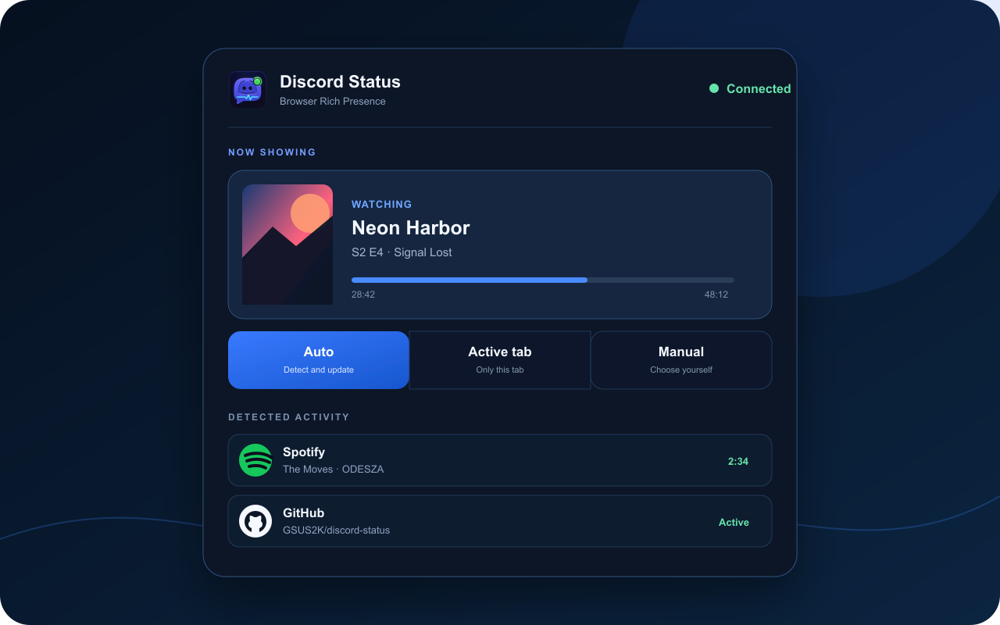
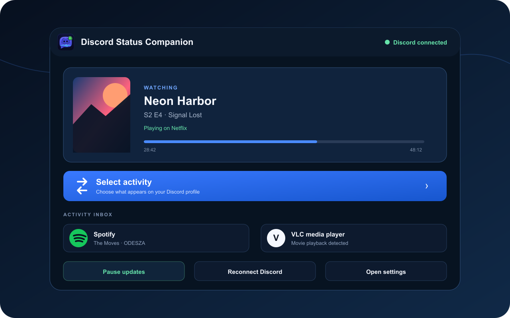
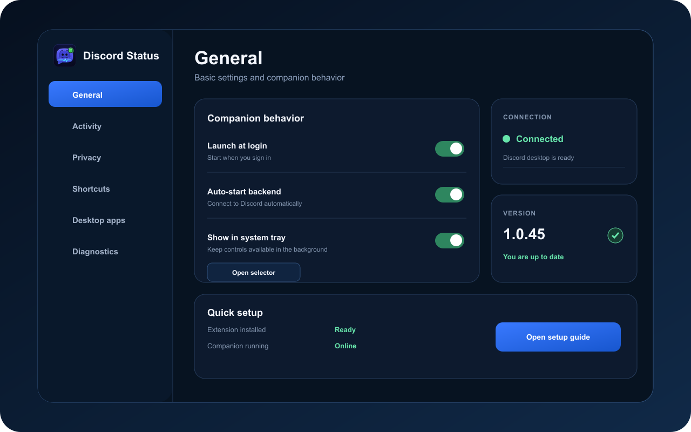

# Discord Status

<p align="center">
  
</p>

<p align="center"><strong>Show what you are watching, listening to, playing, or working on as Discord Rich Presence.</strong></p>

<p align="center">
  <a href="https://gsus2k.github.io/discord-status/"></a>
  <a href="https://chromewebstore.google.com/detail/discord-status/ekobpekegflobmheipgceigkldggkakd"></a>
  <a href="https://github.com/GSUS2K/discord-status/releases/latest"></a>
  <a href="https://github.com/GSUS2K/discord-status/releases"></a>
  <a href="LICENSE"></a>
</p>

## Install

Browser activity needs two parts:

1. Add the [Chrome extension](https://chromewebstore.google.com/detail/discord-status/ekobpekegflobmheipgceigkldggkakd).
2. Choose the correct companion package on the [setup and download site](https://gsus2k.github.io/discord-status/#downloads).
3. Keep Discord desktop open and start Discord Status Companion.
4. Select **Auto** in the extension, or choose a specific activity yourself.

The companion can also show custom activities, VLC, supported desktop apps, and games without a browser tab.

| System | Normal choice | Alternative |
| --- | --- | --- |
| Windows | Setup `.exe` | Managed `.msi` |
| macOS | Apple Silicon `.dmg` | Intel `.dmg` |
| Linux | Portable `.AppImage` | Debian/Ubuntu `.deb` |

Every release includes `SHA256SUMS.txt` for verification.

## Product

<p align="center"></p>

<p align="center">
  
  
</p>

## What It Shows

- Media titles, series, seasons, episodes, tracks, artists, playback state, timing, and source artwork when available.
- YouTube, Netflix, Prime Video, Hulu, Disney+, Apple TV, Hotstar, Crunchyroll, Twitch, Spotify, YouTube Music, SoundCloud, Apple Music, and Bandcamp.
- GitHub, VS Code Web, Linear, Jira, Notion, Google Docs, Figma, Canva, ChatGPT, Google Meet, and other supported browser tools.
- VLC, approved desktop apps, games, and activities written manually.

## Controls

| Mode | Behavior |
| --- | --- |
| Auto | Chooses the most relevant supported activity. |
| Active tab | Shares only the supported tab you are currently using. |
| Manual | Pins a detected activity or a custom status until you change it. |

Site toggles, blocked domains, hidden titles, incognito handling, meeting pauses, playback rules, and keyboard shortcuts are available in settings.

## How It Works

```text
Browser tab -> Chrome extension -> Discord Status Companion -> Discord desktop
Desktop app or custom activity -> Discord Status Companion -> Discord desktop
```

The extension sends selected activity to the companion at `http://localhost:17654`. The companion then updates Discord Rich Presence through Discord desktop. There is no hosted activity relay and no Discord Status account.

## Troubleshooting

**Discord is disconnected:** Open Discord desktop, restart the companion, and choose **Reconnect Discord**.

**The wrong tab is showing:** Use **Active tab**, choose an activity manually, or refresh the media page.

**A title or thumbnail is missing:** Some services do not expose full metadata or publicly reachable artwork. Discord Status uses the information the page or app makes available.

**The versions do not match:** Update both parts. Chrome updates the extension through the Web Store; the companion updates separately from GitHub Releases.

More help is available in [issues](https://github.com/GSUS2K/discord-status/issues).

## Development

Requirements: Node.js, npm, Rust, and the platform toolchain required by Tauri.

```bash
npm install
npm run check
npm run package:webstore
npm run companion:dev
```

The Web Store package is written to `dist/discord-status-webstore.zip`.

## Links

- [Setup and downloads](https://gsus2k.github.io/discord-status/)
- [Chrome Web Store](https://chromewebstore.google.com/detail/discord-status/ekobpekegflobmheipgceigkldggkakd)
- [Latest companion release](https://github.com/GSUS2K/discord-status/releases/latest)
- [Privacy policy](PRIVACY.md)
- [Issues and feature requests](https://github.com/GSUS2K/discord-status/issues)
